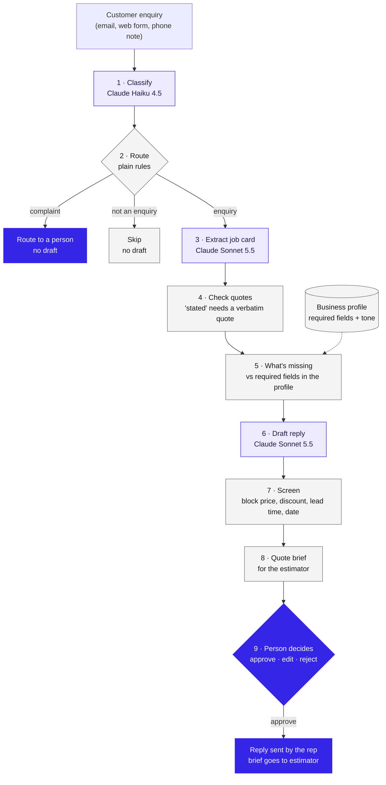
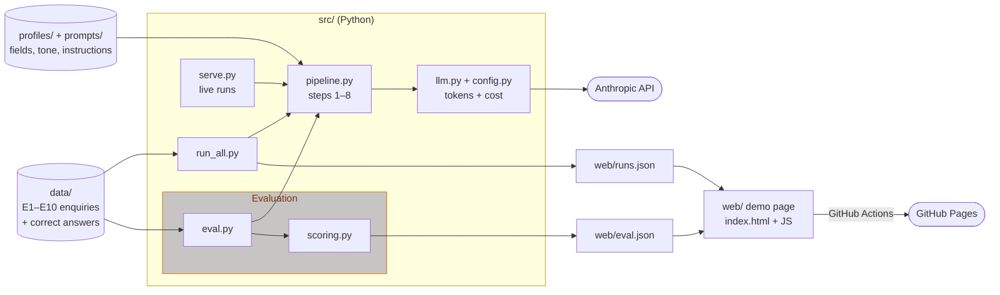

# Quote Brief Copilot

**A GenAI case study with a working prototype.** It turns a messy customer enquiry into a job card, a draft reply and a quote brief for the estimator. A person approves every message and sets every price.

**Live demo:** https://ratanasovann.github.io/quote-brief-copilot/

> The business (Wattlebird Kitchens & Joinery) is fictional and all ten enquiries were written by hand. No real company or customer data is used.

---

## The problem

Every quote starts with a back-and-forth. Enquiries arrive in the customer's own words, by email, web form or phone, and they often leave out something the estimator needs. Take this web form:

> "need a new kitchen asap how much"

To start a quote, the estimator needs the room size, the finish, the colour and whether it's installed. Today a rep re-types the enquiry, works out from memory what's missing and writes back, careful not to guess a price. The customer often answers only half, so the rep writes again and the quote waits.

**With the copilot:** the job card is filled in with each detail quoted from the message, a checklist shows the four missing details, and a draft asks for exactly those, with no price. The rep reads it and approves it, and the customer is asked once.

---

## How it would be used

The copilot sits between the inbox and the quoting process. It never replaces the rep's judgement; it does the re-typing and the checking so the rep's time goes on the customer.

**A typical morning for the sales rep**

1. **New enquiries come in** by email, web form and phone notes. The rep pastes each one in (or, once integrated, it arrives automatically).
2. **The copilot sorts them in seconds.** Complaints and angry messages are flagged for a person straight away, with no draft. Spam and supplier emails are set aside. Requests for products the business doesn't sell get a polite decline to approve.
3. **For each real enquiry, the rep sees one screen:** the customer's message, the job card (green = stated, amber = guessed, red = missing or contradictory), and a draft reply that asks only for what's missing.
4. **The rep reads, edits if needed, and approves.** Nothing is sent without that click. The draft never contains a price, discount or date, and code blocks it if one slips through.
5. **Complete enquiries go to the estimator as a quote brief:** every detail in one place, flagged fields highlighted, exportable to a spreadsheet.

**What each person gets**

| Role | Today | With the copilot |
|---|---|---|
| Sales rep | Re-types every enquiry and remembers what each product needs | Reviews a prepared job card and a ready-to-approve reply |
| Estimator | Chases missing details, or prices on assumptions | Starts from a complete brief with every gap and guess flagged |
| Owner / manager | Can't easily see what was asked or promised | Every draft, edit and decision is logged; the rules for "complete" live in one settings file |
| Customer | Gets asked twice, days apart | Gets one clear reply asking for everything at once |

**What the business controls**

- **What "complete" means for each product:** the required details (size, finish, colour, install, site access…) are set per product in a settings file, not buried in the AI. A new product line is a settings change, not a rebuild.
- **The tone of replies:** also set per product.
- **What can never be said:** prices, discounts, lead times and install dates are blocked by code, not by asking the AI nicely.

---

## Where the value is

The value comes from three places: **rep time, speed to the customer, and fewer quotes that stall.** There are no savings figures here, because without real enquiries any number would be made up. Instead, each line shows how the business could work it out from its own numbers in a two-week baseline.

| Value | Why it matters to the business | How to size it with your own numbers |
|---|---|---|
| **Rep time back** | Re-typing and working out what's missing is admin, not selling. That time could go on follow-ups and closing. | Enquiries per week × (minutes to handle one today − minutes to review a draft) |
| **Faster first reply** | Customers wanting a quote usually contact two or three businesses. The first clear, useful reply often wins the conversation. | Median time from enquiry to first reply, before vs after |
| **Fewer rounds per quote** | Every extra email adds days and is another chance for the customer to go quiet. | Average emails before a quote can start; % of leads that go quiet before quoting |
| **Estimators price, not chase** | Estimator time is expensive and directly drives revenue. A complete brief means it's spent on quoting. | Hours per week estimators spend chasing details; quotes revised because of a wrong assumption |
| **No promises it can't keep** | A price or date guessed in a first reply is hard to walk back, and an upset customer handled by a template becomes a bad review. | Drafts blocked by the price/date screen; complaints correctly routed to a person |
| **Knowledge that doesn't walk out the door** | What a complete enquiry looks like often lives in one experienced person's head. Written down, a new rep asks the right questions on day one. | Time for a new rep to send replies without a senior check |

**Running cost is small and measured:** about **2.1 AU cents** per drafted reply (0.1 cents for a complaint or spam message), or about **$9 AUD a month** at 100 enquiries a week. Even a few minutes of rep time saved per week covers it. The real cost of adopting it is setting up and training, which the plan below covers.

---

## How I'd measure the business value

GenAI tools are easy to demo and hard to justify. The test isn't "does the AI work?" but **"does a person spend less time for the same or better result, and does the business see it in its numbers?"** So every draft a person reviews is timed and logged, and compared against how long the same job takes today.

### What the tool records on every decision

The prototype already logs each approve or reject (see the run log at the bottom of Tab 2):

| Recorded | How | What it tells the business |
|---|---|---|
| **Time to decide** | Seconds from opening the enquiry to clicking Approve or Reject | The human time the task now takes: the number the value case rests on |
| **Time to draft** | Seconds the AI took to produce the job card and reply | How long the rep waits. Should stay well under a minute |
| **% edited** | How many words the rep changed in the draft before approving | Whether drafts are genuinely usable. A heavily edited draft saved little time |
| **Approve / reject** | The rep's decision | How often the tool's output is good enough to use at all |
| **Flagged fields** | Guessed, contradictory or blocked details on the brief | How much checking is left for the estimator |

In the prototype the log stays in the browser. In a pilot it would be saved centrally so it can be reported on.

### Turning time into value

**1. Time saved per enquiry** = *baseline time to handle an enquiry today* − *time to decide with the copilot*

The baseline comes from Phase 1: time reps on, say, 30 enquiries across channels (re-typing, working out what's missing, writing the reply).

**2. Hours back per week** = time saved per enquiry × enquiries per week

**3. Net value per month** = hours back × the rep's hourly cost − AI running cost − time spent maintaining the settings

| Input | Where it comes from |
|---|---|
| Baseline handling time | Timed in discovery (Phase 1) |
| Time to decide | Run log, measured on every draft |
| Enquiries per week | The business's inbox and form counts |
| Rep's hourly cost | The business (wage plus on-costs) |
| AI running cost | Measured: about 2.1 AU cents per drafted reply, about $9 AUD a month at 100 a week |
| Settings upkeep | Estimators' review time, logged in the pilot |

No number here is assumed. The business provides its own inputs and the run log measures the rest.

### Quality checks: time saved only counts if the work is still good

| Signal | Healthy | Warning sign and action |
|---|---|---|
| % edited | Mostly small edits | Large rewrites mean the draft isn't saving time; fix the checklist or tone settings |
| Reject rate | Low and falling | Rising rejects mean the tool is creating work; review the rejected drafts |
| Time to decide | Long enough to read the reply | A few seconds per approval suggests rubber-stamping; spot-check approved replies |
| Blocked drafts | Rare, and always caught | Any price or date reaching a customer is a stop-the-pilot event |

### Business outcomes: did it reach the bottom line?

Time saved is the early signal. The outcomes the owner cares about come later and need inbox or CRM data:

- **Time to first reply:** enquiry received → first useful reply sent.
- **Rounds per quote:** emails before the estimator can start.
- **Leads that go quiet** before a quote is sent.
- **Quote conversion rate:** quotes won ÷ quotes sent, as the longer-term check.

To make sure the change is down to the tool and not a busy or quiet month, compare pilot reps against reps who aren't using it, on the same product line and over the same weeks.

**Reporting:** a one-page weekly summary for the owner covering volume, average time to decide, % edited, reject rate, time to first reply and rounds per quote, with the net value line once the baseline is in.

---

## How the prototype works: AI reads and drafts, code checks, a person decides



*Purple = AI · grey = code · solid indigo = a person.*

| Step | By | What it does |
|---|---|---|
| Classify | AI (Claude Haiku 4.5) | Enquiry, complaint or not an enquiry |
| Route | Code | Complaints go to a person; spam is skipped; no draft for either |
| Extract | AI (Claude Sonnet 5.5) | Job card: each field has a value, a status and an evidence quote |
| Check quotes | Code | Any "stated" field whose quote isn't in the message is downgraded |
| What's missing | Code | Compares the card with the product's required fields |
| Draft | AI (Claude Sonnet 5.5) | Asks only for what's missing, or politely declines out-of-scope work |
| Screen | Code | Blocks any price, discount, lead time or date |
| Decide | Person | Approve, edit or reject. Nothing is ever sent automatically |

Classification runs first, so complaints and spam never reach the more expensive model.

**Tested on ten synthetic enquiries** against hand-written correct answers (`python src/eval.py`). It passed every check: 100% field accuracy (59/59), no invented facts, every missing detail caught (7/7), no prices or dates in any draft, all 10 routed correctly, and the longest reply was 63 words. Ten hand-written enquiries show the design works. They don't show how it performs on a real inbox. That's what the plan below is for.

---

## Future plan: from prototype to the business

Three phases, each ending in a go / no-go decision, so the business only invests further once the last step has shown value. A person approves every message and sets every price throughout.

| Phase | What happens | Decision at the end |
|---|---|---|
| **1. Discovery** (2–3 weeks) | Shadow reps and estimators, time a baseline, define "complete" for each product with the estimators, collect 50–100 past enquiries (with consent), and agree the red lines with the owner | Is the back-and-forth big enough to fix? If not, stop here |
| **2. Shadow-mode pilot** (4–6 weeks) | One or two reps on one product line, tracked with the [value measures](#how-id-measure-the-business-value) above | Do reps trust the drafts, and has the baseline moved? |
| **3. Integrate** | Connect the inbox and web form, the CRM or quoting system and all product lines, plus weekly reporting for the owner | Roll out to the whole team |

---

## Run it yourself

Needs Python 3.11+ and an Anthropic API key.

```bash
python -m venv .venv
.venv\Scripts\activate          # macOS/Linux: source .venv/bin/activate
pip install -r requirements.txt
copy .env.example .env          # then put your key in .env
```

| Command | What it does |
|---|---|
| `python src/validate_data.py` | Checks that profiles, enquiries and labels are consistent |
| `python src/run_one.py E1` | Runs the pipeline on one enquiry |
| `python src/eval.py` | Scores every run against the labels |
| `python src/run_all.py` | Runs everything and writes `web/runs.json` |
| `python src/serve.py` | Demo page at http://localhost:8000, including live "write your own" runs |

The hosted demo shows saved runs only. Live runs use your own API key, so they work only on your computer.

Full specification: [`SPEC.md`](SPEC.md).

## Architecture



The pipeline is one function (`pipeline.run`) used by every entry point, so the evaluation, the saved demo runs and the live runs all go through exactly the same steps. The hosted page has no server: it reads `runs.json` and `eval.json`, so the numbers it shows were measured, not typed in. Live runs need your own API key and only work through `serve.py` on your computer.

## Project layout

```
profiles/          business profiles: required fields and tone per product (JSON)
data/enquiries/    E1–E10 synthetic enquiries
data/labels/       hand-labelled correct answers
prompts/           the three LLM prompts, as plain text
src/               pipeline, checks, evaluation, local server
web/               the demo page (static) + runs.json + eval.json
```

Built by Ratana Sovann.
